# Testing

## Functional Testing

TC001 

**Description**

Test Registration works as expected and emails are sent out.

**Steps**

- Navigate to https://gift-of-giving.herokuapp.com/
- Click the 'Sign-up' navigation link
- Enter your details (email must be real)

**Expected**

Email is sent with a verifcation link in it.

**Actual**

Email is sent with a verifcation link in it.

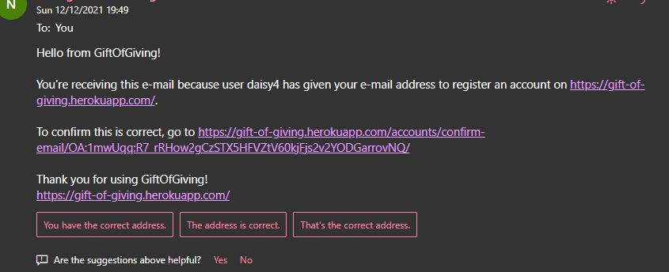

TC002

**Description**

Test verification of email works and user is able to log in. This is dependent on TC001 being completed.

**Steps**

- Click the email verification link in the email that was sent in TC001
- Click verify email button on the website once new window opens
- Attempt to log in with newly created credentials

**Expected**

Account logs in successfully.

**Actual**

Account logs in successfully.

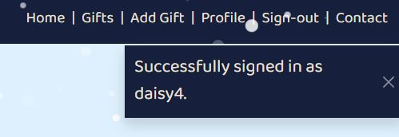

TC003

**Description**

Test profile can be updated.

**Steps**

- Log in to the website
- Click the 'Profile' navigation link
- Click Edit profile
- Fill in the form and press the 'update' button

**Expected**

Profile is updated successfully.

**Actual**

Profile is updated successfully.

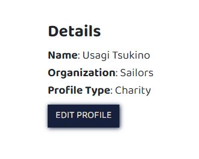

TC004

**Description**

Test that when you register as a charity, you can update the charities address.

**Steps**

- Log in to the website with a charity account
- Click the 'Profile' navigation link
- Click Edit Address 
- Fill in the form and press the 'update address' button

**Expected**

Charity Address is updated successfully.

**Actual**

Charity Address is updated successfully.

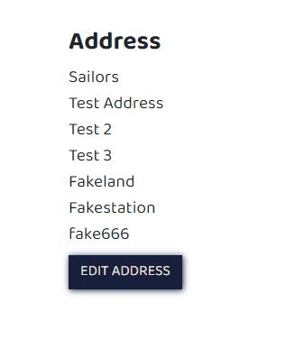

TC005

**Description**

Test that when a charity registers, information on how to get verified is displayed on the profile page.

**Steps**

- Log in to the website with a charity account
- Click the 'Profile' navigation link
- Edit Address & Profile information

**Expected**

Information is displayed explaining how to verify the charity.

**Actual**

Information is displayed explaining how to verify the charity.

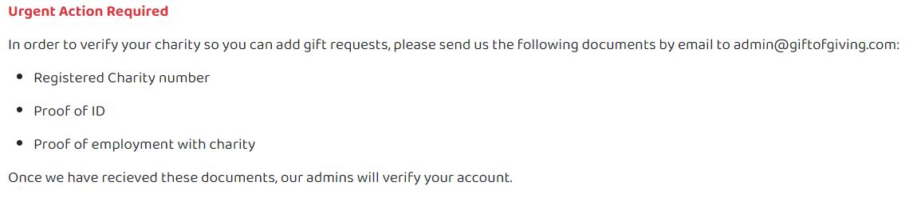

TC006

**Description**

Ensure that when a charity is verified, they can access the gifts page and add a gift.

**Steps**

- Log in to the website with a charity account that has been verified
- Click the 'Add gift' navigation link
- Fill in the form and click add gift request button
- Navigate to the gifts page and ensure newly created gift is present

**Expected**

Gift is successfully added and can now be viewed on the gifts page.

**Actual**

Gift is successfully added and can now be viewed on the gifts page.

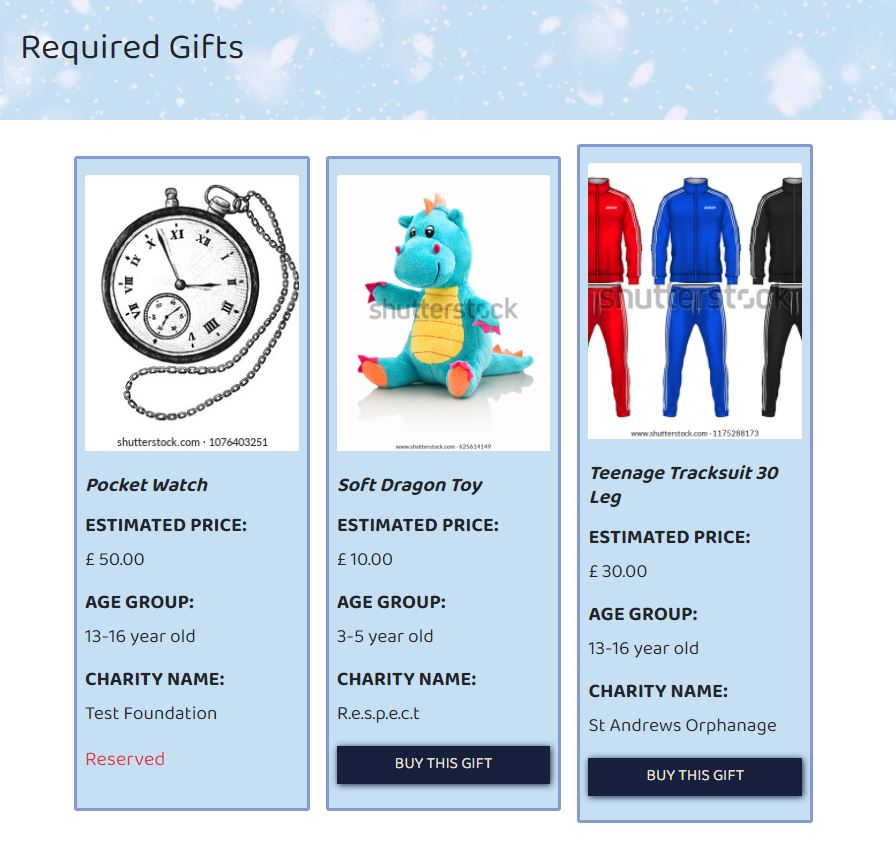

TC007

**Description**

Ensure that a charity who registered the gift is able to update the gift.

**Steps**

- Log in to the website with a charity account that has added a gift.
- Click the 'Gifts' navigation link and locate the gift
- Click buy now
- Click the edit gift button
- Fill in the new details and submit the form

**Expected**

The gift has successfully updated with the new details.

**Actual**

The gift has successfully updated with the new details.

TC008

**Description**

Ensure that when a charity is not verified, they cannot access the add gift page.

**Steps**

- Log in to the website with a charity account that has not been verified
- Click the 'Add gift' navigation link

**Expected**

A flash message is displayed alerting the user that they need to be verified first.

**Actual**

A flash message is displayed alerting the user that they need to be verified first.

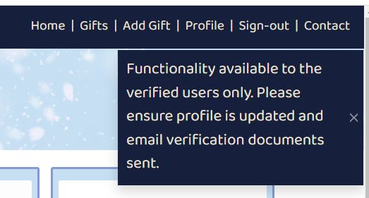

TC009

**Description**

Ensure that a gift can be committed to buying.

**Steps**

- Log in to the website with a registered user.
- Navigate to gifts page.
- Click on buy gift
- Click the submit button

**Expected**

Gift is updated and information is displayed to the user with the postal address for the gift and the status of the gift on the gifts page has updated to reserved.

**Actual**

Gift is updated and information is displayed to the user with the postal address for the gift and the status of the gift on the gifts page has updated to reserved.

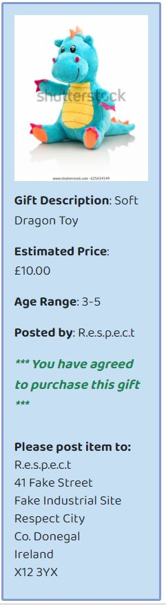

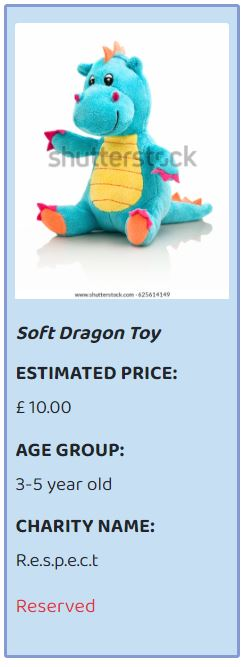

TC010

**Description**

Ensure that the contact form submits to the database.

**Steps**

- Click the 'Contact' navigation link
- Fill in the contact form
- Click the submit button

**Expected**

Flash message is displayed to alert the user of successful submission and the contact request can be seen from the admin panel in the contact table.

**Actual**

Flash message is displayed to alert the user of successful submission and the contact request can be seen from the admin panel in the contact table.

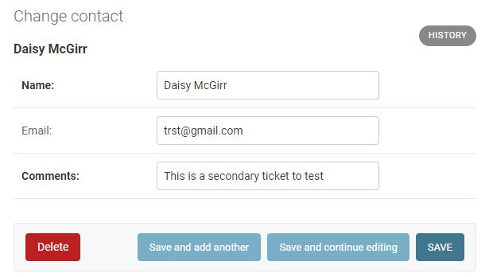

TC011

**Description**

Ensure that the contact form submits does not submit if required fields are left blank.

**Steps**

- Click the 'Contact' navigation link
- Try to submit the form with a blank name
- Try to submit the form with a blank comment

**Expected**

Form does not submit and message is displayed to say it cannot be blank.

**Actual**

Form does not submit and message is displayed to say it cannot be blank.

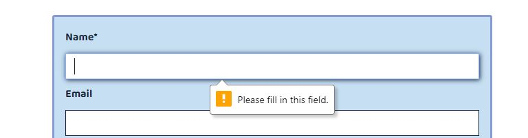

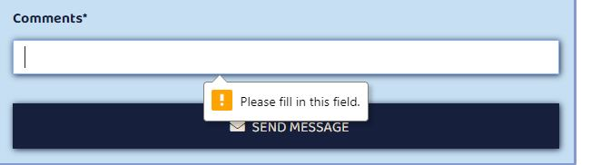

TC012

**Description**

Ensure 404 page is displayed.

**Steps**

- Click the website and append the url with a random string
- Hit enter

**Expected**

404 page is displayed.

**Actual**

404 page is displayed.

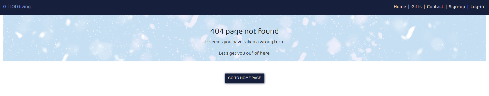

TC013

**Description**

Ensure 500 page is displayed.

**Steps**

- Login with admin user in the /admin panel
- Update a organisation name on a charity address profile
- Go to gifts and attempt to edit a gift the charity has created

**Expected**

500 page is displayed.

**Actual**

500 page is displayed.

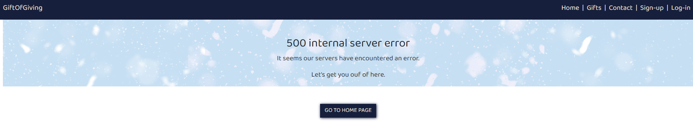

TC014

**Description**

Ensure footer links open in a new tab.

**Steps**

- Go to the main website and click each of the 4 social media icons:
    - Twitter
    - Facebook
    - Instagram
    - LinkedIn

**Expected**

All icons open the respective websites in a new tab.

**Actual**

All icons open the respective websites in a new tab.

## Validator Testing

### CSS

Profiles CSS

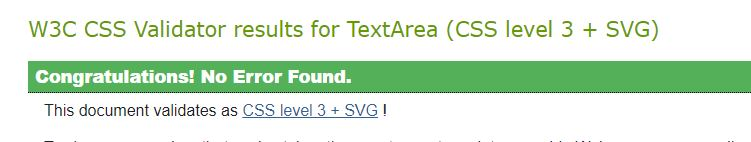

Base Css

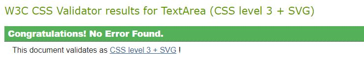

### JavaScript

Base JS

### HTML

The following Validated with no errors:
- Home Page
- Gifts Page
- Profile Page
- Contact Page

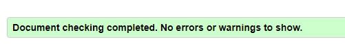

The Following Validator with the same error:
- The Edit Profile Page
- The Edit Address Page
- The Add Gift Page
- The Edit Gift Page

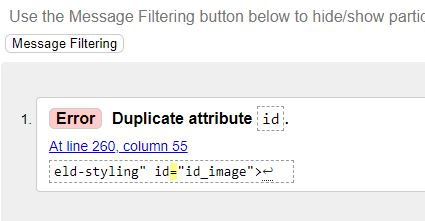

The error showing duplicate id's is coming from the use of django forms. For each form field it created, it created a div with the same id as the form input. We have been unable to find a resolution to this yet but it is under investigation.